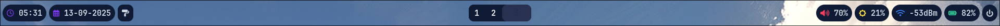
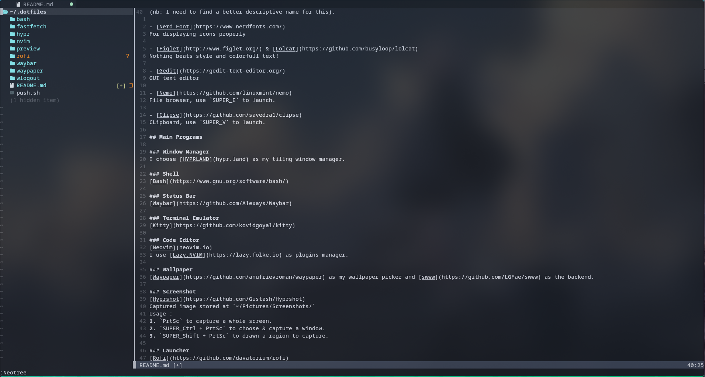
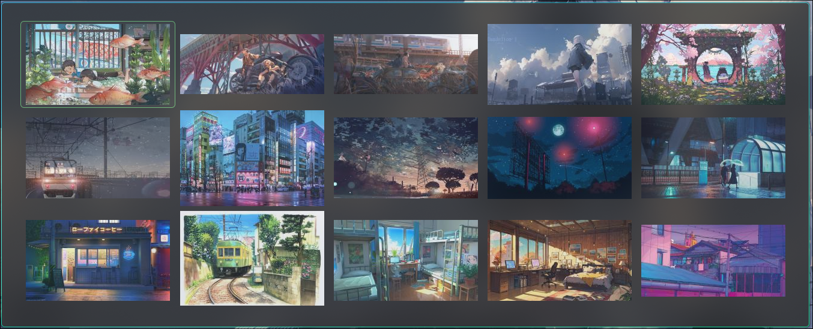
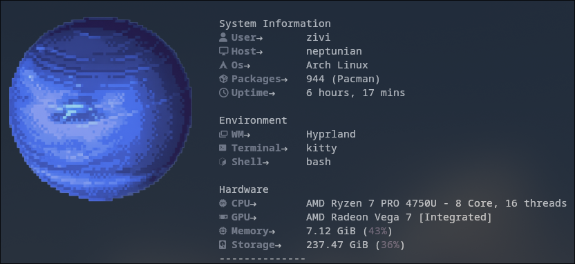

# MY PERSONAL DOTFILES

This repo was intended to documenting my personal's Arch Linux system.
I'll try to make this as detail as i can, feel free to use it yourself.

# Table of Contents
- [Directory Structure](#directory-structure)
- [Installed Programs](#installed-programs)
    - [utility Apps](#utility-apps)
    - [Main Programs](#main-programs)
        - [Window Manager](#window-manager)
        - [Shell](#shell)
        - [Status Bar](#status-bar)
        - [Terminal Emulator](#terminal-emulator)
        - [Code Editor](#code-editor)
        - [Wallpaper](#wallpaper)
        - [Screenshot](#screenshot)
        - [Launcher](#launcher)
        - [Session Manager](#session-manager)
        - [Logout Menu](#logout-menu)
        - [Screen Lock](#sreen-lock)
        - [Idle Session](#iddle-session)
        - [Notification Daemon](#notification-daemon)
        - [Color Palette Generator](#color-palette-generator)
        - [GTK Looks](#gtk-looks)
        - [System Restore](#system-restore)
        - [System Information](#system-information)
    - [Custom Scripts](#custom-scripts)

# Directory Structure

All config files is saved in `~/.dotfiles` and using [GNU Stow](https://www.gnu.org/software/stow/) to distribute them to their default directory.  
Wallpapers is stored in `usr/share/Wallpapers` to make them accessible to other user.

# Installed Programs
## Utility Apps

Here's a list of programs that I install as is or minimun config, and tools to run this setup properly :  
(nb: I need to find a better descriptive name for this).

- [Nerd Font](https://www.nerdfonts.com/)
For displaying icons properly

- [Figlet](http://www.figlet.org/) & [Lolcat](https://github.com/busyloop/lolcat)
Nothing beats style and colorfull text!

- [Gedit](https://gedit-text-editor.org/)
GUI text editor

- [Nemo](https://github.com/linuxmint/nemo)
File browser, use `SUPER_E` to launch.

- [Clipse](https://github.com/savedra1/clipse)
CLipboard, use `SUPER_V` to launch.

- [nmgui](https://github.com/s-adi-dev/nmgui)
A simple, lightweight GTK4-based GUI for NetworkManager using nmcli.

- [Warpinator](https://github.com/linuxmint/warpinator)
Send and receive files across a local network.

- [ncdu](https://github.com/rofl0r/ncdu)
CLI tool for analyzing disk space usage.

## Main Programs

### Window Manager
I choose [HYPRLAND](hypr.land) as my tiling window manager.

### Shell
[Bash](https://www.gnu.org/software/bash/)

### Status Bar
[Waybar](https://github.com/Alexays/Waybar)

### Terminal Emulator
[Kitty](https://github.com/kovidgoyal/kitty)

### Code Editor
[Neovim](neovim.io)

I use [Lazy.NVIM](https://lazy.folke.io) as plugins manager. Also it's highly refference to [tony](https://www.youtube.com/watch?v=46z_h4bNzjk&list=WL&index=1&t=123s) & [Henry Misc](https://youtu.be/KYDG3AHgYEs?si=L_Rcp7PIGb51Dinp) tutorial video.

### Wallpaper
[Waypaper](https://github.com/anufrievroman/waypaper) as my wallpaper picker and [swww](https://github.com/LGFae/swww) as the backend.

### Screenshot
[Hyprshot](https://github.com/Gustash/Hyprshot)  
Captured image stored at `~/Pictures/Screenshots/`  
Usage :
1. `PrtSc` to capture a whole screen.
2. `SUPER_Ctrl + PrtSc` to choose & capture a window.
3. `SUPER_Shift + PrtSc` to drawn a region to capture.

### Launcher
[Rofi](https://github.com/davatorium/rofi)  
`SUPER_R` to run Rofi.

### Session Manager
[uwsm](https://github.com/Vladimir-csp/uwsm)

### Logout Menu
[Wlogout](https://github.com/ArtsyMacaw/wlogout), might replace with custom rofi scripts later.

### Screen Lock
[Hyprlock](https://wiki.hypr.land/Hypr-Ecosystem/hyprlock/)

### Idle Session
[Hypridle](https://wiki.hypr.land/Hypr-Ecosystem/hypridle/)

### Notification Daemon
[SwayNC](https://github.com/ErikReider/SwayNotificationCenter)

### Color Palette Generator
[Pywal16](https://github.com/eylles/pywal16)  
This tool generate color palette from current wallpaper and use it accross other programs.

### GTK Looks
[nwg-look](https://github.com/nwg-piotr/nwg-look)

### System Restore
[Timeshift](https://github.com/linuxmint/timeshift)  
I use [typecraft's tutorial](https://youtu.be/V1wxgWU0j0E?si=VDn8snMtPCyONjyH) setup.

### System Information
[Fastfetch](https://github.com/fastfetch-cli/fastfetch)

## Custom Scripts

### push.sh
Automated git command to make add, comment and push proccess easier. It content all config files installed on my system.

  
Usage :  
1. Use bash aliases `dotfiles` & `push` to go to dotfiles dir and run this script.
2. Type a number that shows in the menu option to add your file
3. Type a comment for that file
4. Choose [y]es to add more files, i'll loop back to the menu, or choose [n]o to push it.
5. Enter SSH key if required.

I create separeted repo for this [here](https://github.com/mrheriyansyah/git-automation.git).
